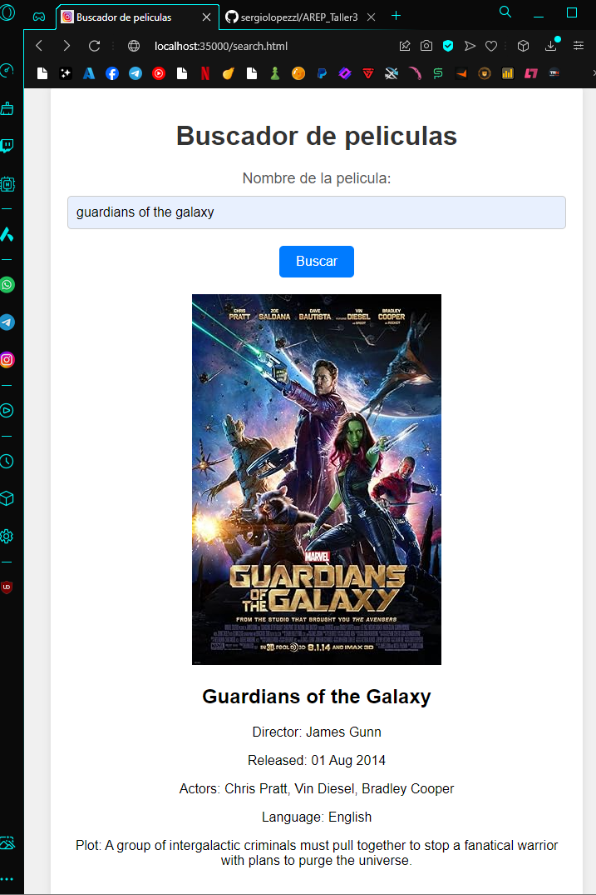
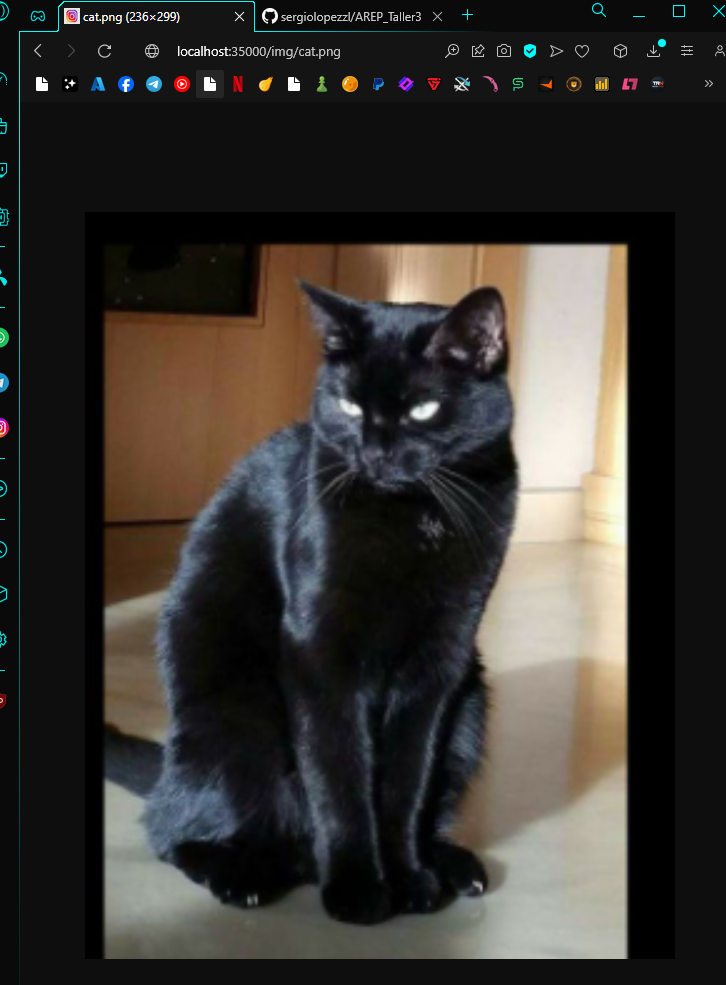
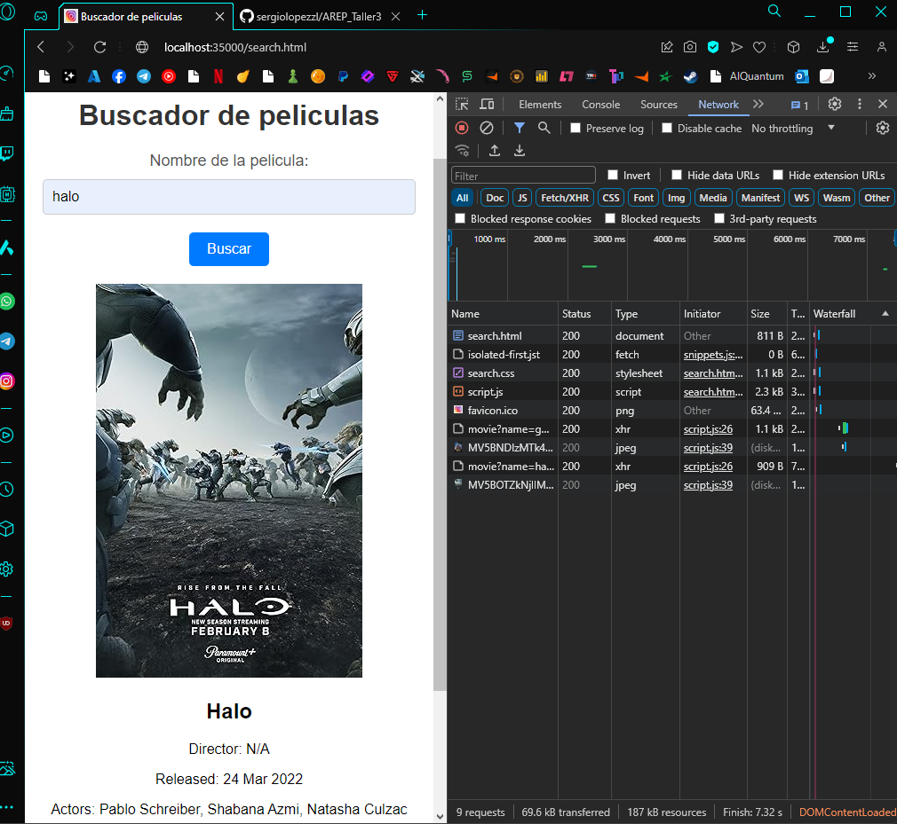
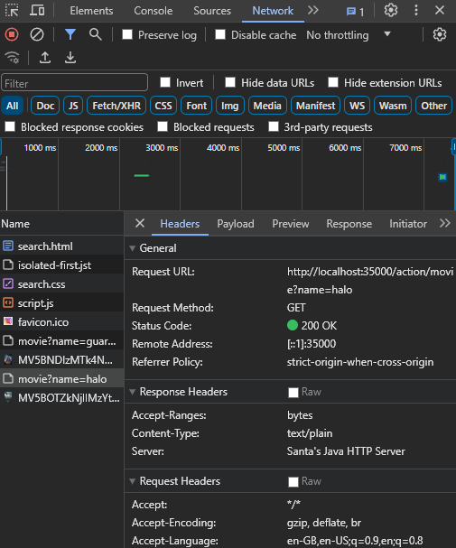

### Sergio Daniel Lopez Vargas
# AREP_Taller3
Este taller3 se crea una funcionalidad similar a Spark que es un servidor HTTP que permite el registro 
dinámico de servicios GET y POST utilizando funciones lambda para manejar las solicitudes entrantes. 
Este servidor web también ofrece la capacidad de configurar el directorio de archivos estáticos, 
lo que permite servir archivos estáticos como HTML, CSS, JavaScript, imágenes, etc. Además, proporciona 
la capacidad de cambiar dinámicamente el tipo de respuesta a "application/json" según sea necesario.

### Funcionamiento

1. **SLSpark**:
  - SLSpark actúa como un enrutador para las solicitudes HTTP entrantes.
  - Permite registrar manejadores de solicitud para rutas específicas y métodos HTTP.
  - Cuando llega una solicitud HTTP, SLSpark determina el manejador correspondiente según la ruta y el método HTTP especificados y lo ejecuta.

2. **HttpServer**:
  - HttpServer es responsable de iniciar y ejecutar el servidor HTTP.
  - Escucha en un puerto específico para las solicitudes entrantes.
  - Cuando se recibe una solicitud, HttpServer la procesa, determina la acción requerida y envía la respuesta adecuada al cliente.

3. **HttpMovie**:
  - HttpMovie se encarga de realizar solicitudes HTTP a una API externa de películas para obtener información sobre películas específicas.
  - Procesa las respuestas de la API y extrae la información relevante sobre las películas solicitadas.
  - Puede almacenar en caché los datos obtenidos para futuras consultas y evitar realizar solicitudes repetidas a la API externa.

4. **AppService**:
  - AppService es una interfaz que define un contrato para las clases que manejan las solicitudes de la aplicación.
  - Define un método que debe ser implementado por las clases que manejan las solicitudes de la aplicación.
  - Permite una implementación flexible de los servicios de la aplicación, lo que facilita la modularidad y la extensibilidad del sistema.

Este servidor web interactúa con una API externa para obtener información sobre películas.
Utiliza una clase llamada HttpMovie para realizar solicitudes HTTP a la API de películas y procesar
las respuestas recibidas. Esta clase gestiona la comunicación con la API, extrae la información
relevante sobre las películas solicitadas y puede almacenar en caché los datos obtenidos para evitar
solicitudes repetidas a la API externa.

### Instrucciones de Ejecución
* Clone el repositorio desde GitHub:

```
git clone https://github.com/sergiolopezzl/AREP_Taller3.git
```

* Navegue al directorio del proyecto: 

```
cd AREP_Taller3
```

* Compile el proyecto y descargue las dependencias con Maven: 

```
mvn clean package
```

* Ejecute el servidor utilizando el siguiente comando: 

```
mvn exec:java '-Dexec.mainClass=edu.escuelaing.arem.ASE.app.App'
```

Una vez que el servidor esté en funcionamiento, acceda a 
http://localhost:35000/search.html desde su navegador para comenzar a buscar películas.

### Pruebas
* Se realizó la petición a http://localhost:35000/index.html

* Se realizó la petición a http://localhost:35000/search.html

* Se realizó la petición a http://localhost:35000/cat.png

* Se realizó la petición a http://localhost:35000/search.html y se busco Halo

* Aca se puede observar como se obteniene el GET


### Diseño y Extensibilidad

La modularidad y la flexibilidad están integradas en el sistema a través de varias clases y componentes,
como HttpServer, SLSpark y AppService. Estas clases permiten construir un sistema que puede manejar
eficientemente las solicitudes HTTP entrantes, interactuar con servicios externos y proporcionar respuestas
adecuadas a los clientes que realizan las solicitudes. La arquitectura modular facilita la extensibilidad
y escalabilidad del sistema, lo que permite agregar nuevas funcionalidades y adaptarse a los cambios en
los requisitos con relativa facilidad.
